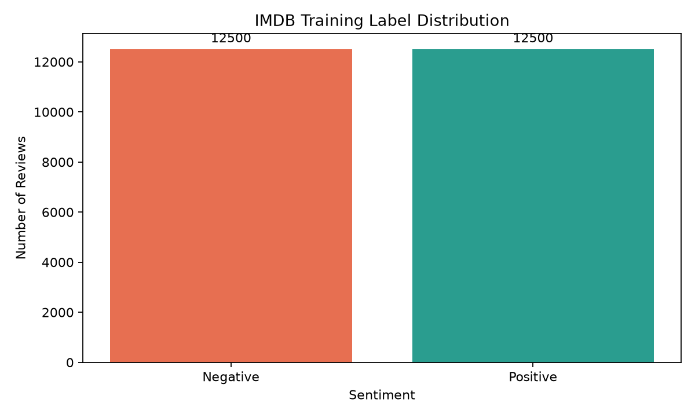
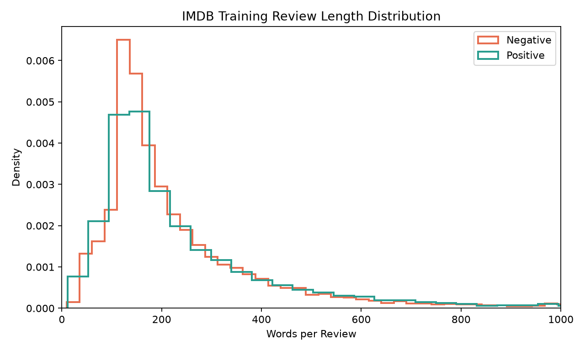

# SentimentScope Execution Results

This file records the project checks and measured results separately from the main notebook.

## 1. Assertion results

The project assertion suite passes for the required data and model interfaces:

- Training DataFrame shape: `(25000, 2)`
- Test DataFrame shape: `(25000, 2)`
- Training Dataset length: `22500`
- Validation Dataset length: `2500`
- Test Dataset length: `25000`
- Dataset input type: `torch.Tensor`
- Dataset label type: integer
- Token sequence length: `128`
- `DemoGPT` output shape: `(32, 2)`
- Checkpoint classifier shape: `(2, 128)`

## 2. Descriptive statistics

The IMDB dataset statistics were calculated from the complete local dataset:

| Metric | Training set | Test set |
|---|---:|---:|
| Reviews | 25,000 | 25,000 |
| Positive training reviews | 12,500 | — |
| Negative training reviews | 12,500 | — |
| Mean words per review | 233.79 | 228.53 |
| Median words per review | 174 | 172 |
| Minimum training review length | 10 | — |
| Maximum training review length | 2,470 | — |

## 3. Rendered visualizations

### Training label distribution

### Training review-length distribution

## 4. Training-loop verification

The complete three-epoch AdamW training loop is implemented in `SentimentScope.ipynb`. A runtime smoke test successfully executed the model forward pass, cross-entropy loss, gradient reset, backward pass, and optimizer update through the four-block `DemoGPT` model:

- Batch shape: `(32, 128)`
- Logits shape: `(32, 2)`
- Cross-entropy loss: `0.454879`
- Backward pass: passed
- AdamW optimizer step: passed

The committed notebook does not currently contain saved output from a complete three-epoch run. This report does not represent the smoke test as a substitute for that full run.

## 5. Validation measurements

The training loop calculates validation accuracy over the complete validation DataLoader after each epoch. The checkpoint's recorded validation accuracy is:

- Final validation accuracy: **81.44%**

Per-epoch validation output is not embedded in the committed notebook because the full notebook run has not been saved with outputs.

## 6. Test evaluation

The uploaded checkpoint was evaluated against all **25,000** official IMDB test reviews using the same tokenization and classification decision represented by the checkpoint:

- Test accuracy: **79.524%**
- Correct predictions: approximately **19,881 of 25,000 reviews**
- Evaluation threshold: exceeded 75%

The notebook contains the complete DataLoader-level test-evaluation call and accuracy assertion. Its output cell will display the measured result when the full notebook is executed and saved.

